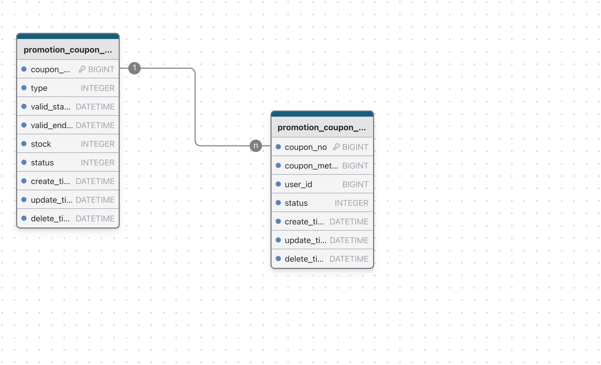

> 此文档记录本系统的开发过程

# 1.概述

本模块主要用于优惠券的发放，且是一个下游模块。
主要的职责为所有优惠券的发放、核销、查询。
预计本系统落地后QPS为10w，并且需要管理优惠券完整的生命周期

# 2.技术选型

## 数据库选型

数据库在本系统的作用：运用其ACID特性，支持并发持久化对存储数据

本系统需要进行持久化操作、条件查询、事务处理，故选用通用的结构化存储中间件MySQL

## 缓存选型

缓存在本系统的作用：运用其高频的读写去减轻对数据库对冲击。
但需要注意缓存穿透、击穿、雪崩问题

本系统选用主流的缓存Redis作为缓存中间件

## 消息队列选型

消息队列在本系统的作用：运用消息队列的延迟消息实现券模板/券记录展示过期状态

本系统选用支持延迟消息的RocketMQ

## 分库分表框架选型

分库分表在本系统的作用：能够将I/O压力分散到不同的数据库中，以提升系统整体的并发性能

本系统选用Gorm官方推荐的Sharding插件进行分库分表操作，其原理是在Conn层做了SQL 拦截、AST 解析、分表路由、自增主键填充，并无额外操作。
所以觉得选用此框架

## RPC框架选型

RPC框架在本系统的作用：作为一个下游模块，供上游模块调用

本系统采用字节跳动自研的kitex，也可以换成其他框架。

# 3.系统设计

## 1.目录介绍

| 目录              | 介绍         |
|-----------------|------------|
| pkg/constants   | 常数         |
| pkg/bound       | 定制绑定处理程序   |
| pkg/errno       | 自定义错误码     |
| pkg/middleware  | RPC 中间件    |
| pkg/tracer      | 初始化 Jaeger |
| cmd/xxx/dal     | 数据库操作      |
| cmd/xxx/pack    | 数据包        |
| cmd/xxx/service | 业务逻辑       |

## 2.技术架构


## 3.功能模块

### 券模板服务

1. 增加券模板功能
2. 删除券模板功能
3. 查询券模板功能
4. 修改券模板功能
5. 获取券模板的是否有效
6. 获取券模板的库存信息
7. 扣减券模板库存

### 券记录服务

1. 给指定用户发券
2. 管理券的状态（过期，已使用）
3. 查询券记录

## 4.数据库设计

### 1.数据结构ER图



### 2.数据库DDL

```mysql
CREATE TABLE `promotion_coupon_meta`
(
    `coupon_meta_no`   BIGINT NOT NULL AUTO_INCREMENT UNIQUE,
    `type`             INTEGER,
    `valid_start_time` DATETIME,
    `valid_end_time`   DATETIME,
    `status`           INTEGER,
    `stock`            INTEGER,
    `create_time`      DATETIME,
    `update_time`      DATETIME,
    `delete_time`      DATETIME,
    PRIMARY KEY (`coupon_meta_no`)
);


CREATE TABLE `promotion_coupon_record`
(
    `coupon_no`      BIGINT NOT NULL AUTO_INCREMENT UNIQUE,
    `coupon_meta_no` BIGINT,
    `user_id`        BIGINT,
    `status`         INTEGER,
    `create_time`    DATETIME,
    `update_time`    DATETIME,
    `delete_time`    DATETIME,
    PRIMARY KEY (`coupon_no`)
);


CREATE INDEX `promotion_coupon_record_index_0`
    ON `promotion_coupon_record` (`coupon_meta_no`, `user_id`);

```

### 3.使用docker创建一个mysql

```shell
 docker run -p 3306:3306 --name JY_mysql -e MYSQL_ROOT_PASSWORD=123456 -d mysql
```

## 4.功能流程

# 使用工具

Goland：https://www.jetbrains.com/go/

飞书：https://www.feishu.cn

数据库设计工具drawdb：https://drawdb.vercel.app/

docker：https://www.docker.com/